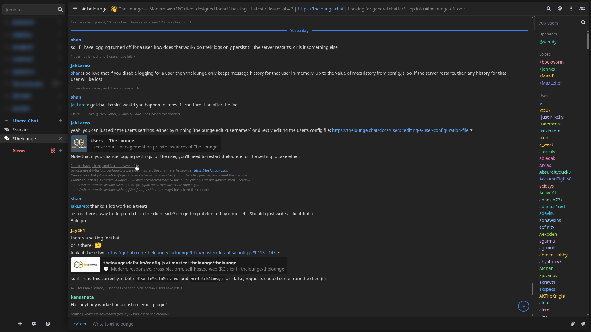

# The Lounge cy1der's Theme


An opinionated theme for [The Lounge](https://thelounge.chat/).

<p align="center">
    
</p>

## Installation

Via the `thelounge` command line:

```bash
thelounge install thelounge-theme-cy1der
```

## License

This plugin is licensed under [MIT](https://opensource.org/license/mit)
